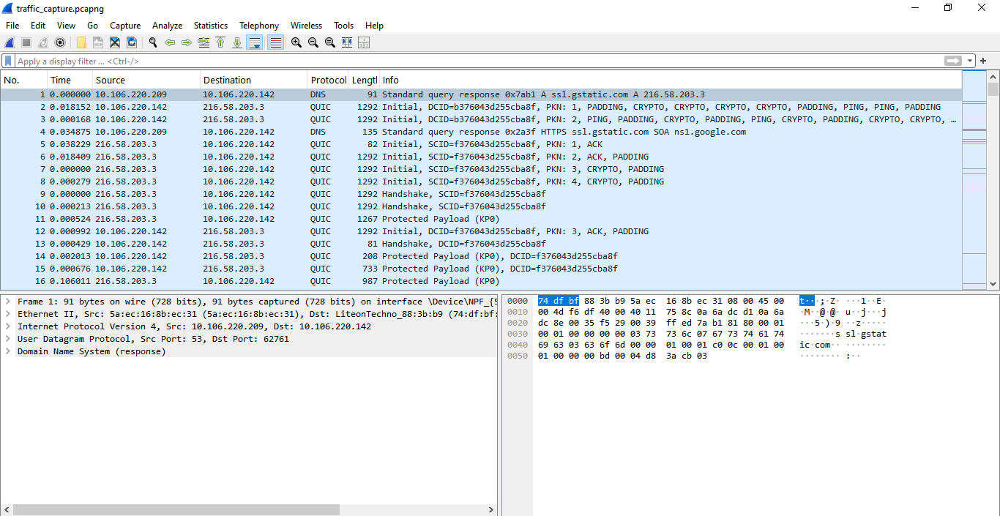
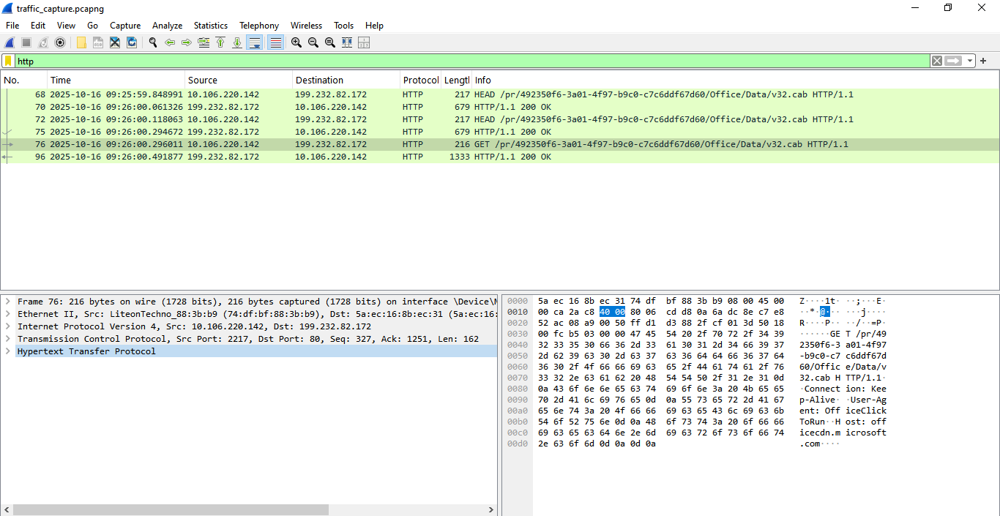
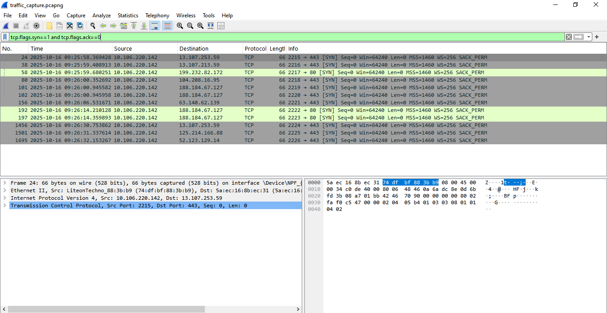
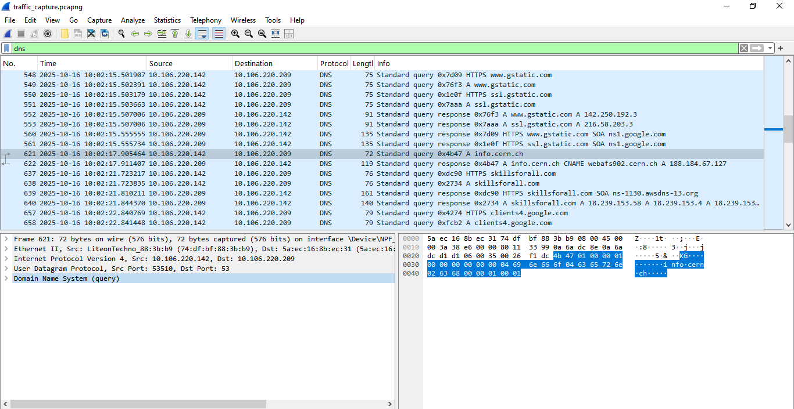

🧩 Network Forensics and Reconnaissance Analysis (NFRA)

**Analyst:** Mohamed Asmy 

**Date:** [16.10.2025] 

**Tool:** 
- **Wireshark** (Network Protocol Analyzer)
- **Nmap** (Network Scanner) 
- **Windows 10 PC** (Local machine use to perform traffic capture and scanning test)
- **Chrome Browser** (Used to visti website)

**Case File:** `traffic_capture.pcapng`

---

## 📘 Table of Contents

1.  [🧭 Project Overview](#-project-overview)
2.  [🎯 Objective](#-objective)
3.  [🧰 Tools Used](#-tools-used)
4.  [📂 Evidence Overview](#-evidence-overview)
5.  [🌐 Traffic Summary](#-traffic-summary)
6.  [🚨 Findings](#-findings)
7.  [🧩 Indicators of Compromise (IOCs)](#-indicators-of-compromise-iocs)
8.  [🧾 Conclusion](#-conclusion)
9.  [👀 Recommendations](#-recommendations)
10. [🖼️ Screenshots and Evidence](#-screenshots-and-evidence)
11. [🎓 Learning Outcomes](#-learning-outcomes)
12. [🏁 Project Summary](#-project-summary)
 
---

## 🧭 Project Overview

This project simulates a **Security Operations Center (SOC) Analyst** task to conduct **network traffic analysis** on a captured PCAP file. 
The goal was to identify critical security events, understand basic protocol functionality (HTTP, DNS, TCP), 
and detect **network reconnaissance** activity performed using Nmap, thereby demonstrating proficiency in forensic packet inspection with Wireshark.

---

## 🎯 Objective

The primary objective was to demonstrate the ability to effectively **isolate, interpret, and document** different types of network 
communication within a capture file, focusing on both normal operations (DNS, web browsing) 
and anomalous/hostile activity (port scanning).

---

## 🧰 Tools Used

- Wireshark 🦈 (Network Protocol Analyzer)

- Nmap (Network Scanner)

- Web Browser 🌐 (Used to generate specific DNS and HTTP traffic)

- Windows 10 PC 🖥️ (Local machine use to perform traffic capture and scanning test)

---

## 📂 Evidence overview 

Three primary security and network events were successfully isolated and analyzed:

1. **Unencrypted Web Traffic (HTTP):** Identification of clear-text data transmission.

2. **Network Reconnaissance (SYN Stealth Scan):** Detection of an Nmap port scanning attempt.

3. **Domain Name System (DNS) Resolution:** Analysis of a standard DNS query and response.

---

## 🌐 Traffic Summary

- **Total Packets Captured:** 1470

- **Most Common Protocols:** TCP, DNS, HTTP, Ethernet.

- **Key IP Addresses Observed:**

 - Local Host: 10.106.220.142

 - External HTTP Server (info.cern.ch): 188.184.67.127

---

## 🚨 Findings

- **HTTP Traffic**

  - Founded visible **Get requests and response headers** when accessing non-HTTPs websites.
  - Sensitive data (URLs, parameters) could be seen in plaintex - **not secure**.

- **DNS Queries**

  - Recorded mutible **domain lookups** (A,AAAA,and PTR queries).
  - DNS traffic was **not encrypted-** potential data leakage risk.

- **SYN Scan Detection**

  - The `tcp.flags.syn==1` and `tcp.flags.ack==0`filter showed multiple SYN packets from **10.106.220.142
   confirming **Nmap port scan activity.**
  - Indicates how attackers can probe open ports stealthily.

---

## 🧩 Indicators of Compromise (IOCs)

While no confirmed compromise was detected (as this was a controlled exercise), the following are recorded as key Indicators of Attack (IOAs):

- **IOA Type:** Reconnaissance

- **Packet Signature:** High volume of TCP SYN packets without corresponding SYN-ACK or RST responses from the target (characteristic of a stealth scan).

---

## 🧾 Conclusion

The exercise successfully utilized Wireshark to dissect and interpret network traffic, proving the ability to distinguish between legitimate 
network operations (DNS) and potentially hostile activity (SYN scanning). The identification of clear-text HTTP traffic also underscores critical 
security findings in real-world scenarios.

---

## 👀 Recommendations

Based on the findings, the following security recommendations are necessary:

1. **Implement Transport Layer Security (TLS):** All public-facing web services must be secured with HTTPS to prevent the clear-text exposure of data observed in the HTTP analysis.

2. **Deploy Edge Filtering/IDS:** Implement an Intrusion Detection System (IDS) or firewall rules capable of rate-limiting or blocking rapid, repetitive connection attempts (SYN packets) 
     from a single source to mitigate the effects of port scanning.

3. **Harden External Services:** Ensure all public services expose only the minimum required ports. Filter ingress traffic to drop packets for unused services.

---

## 🖼️ Screenshots and Evidence

Screenshot_Main_Capture.png 

Screenshot_Finding_1_Unencrypted_HTTP.png 

Screenshot_Finding_2_Nmap_SYN_Scan.png 

Screenshot_Finding_3_DNS_Queries.png 

---

## 🎓 Learning Outcomes

This project provided hands-on experience in:

1. **Deep Packet Inspection:** Understanding the OSI model layers presented by Wireshark (Frame, Ethernet, IP, TCP/UDP, Application).

2. **Advanced Filtering:** Mastering specific display filters to isolate targeted traffic types and flags (e.g., tcp.flags.syn).

3. **Threat Identification:** Recognizing the signature of a common reconnaissance technique (SYN scanning) without needing external security alerts.

___

## 🏁 Project Summary

This project involved a targeted analysis of network traffic using **Wireshark** and **Nmap** to demonstrate foundational networking principles and security reconnaissance techniques. 
The primary objective was to successfully capture and interpret three distinct phases of activity:

1. **Protocol Demonstration (DNS & HTTP):** The project established a clear, unencrypted connection to the historic website info.cern.ch. The analysis successfully isolated the 
   **DNS query/response** and the subsequent **clear-text HTTP GET request packets,** demonstrating the absence of encryption (port 80) and revealing plain-text data.

2. **Reconnaissance Simulation (Nmap Scan):** A port scanning simulation was performed using Nmap, generating a unique traffic pattern. The analysis isolated the characteristic 
   **TCP SYN-Flood packets,** confirming the ability to identify aggressive reconnaissance activity on a network.

Tools Used: Wireshark, Nmap, Command Line Interface (CLI).

---
**© 2025 Mohamed Asmy — Cybersecurity Portfolio Project (CCP2)** 
